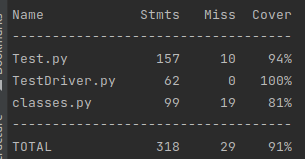

Source code for this project can be found at: 
_https://github.com/danunr/CS333FinalProject_ 

__Summary of gameplay__

This project is a player vs player game of chess written in python. The game is interacted with via the command line by writing grid-like instruction on which piece you would like to move, and where you want to move it to For example to move a pawn in tile "a2" to tile "a3" the user would type the following in the command line:

_a2 a3_

The game will execute, alternating between the two players turns until one of the players win. The game is programmed to only allow moves which are in standard chess rules (for example each piece has different movements it can make).

The game is compatible with Ubuntu. The source code for the game is in main.py and classes.py.

All code from these two python files was originally written by Github user rsheldiii (see _https://gist.github.com/rsheldiii/2993225_), and refactored by Dan Eassa to implement testing.

__For developers__

The repository also contains unit test and integration tests. The unit tests provide 78% coverage of classes.py, and unit and integration tests combined provide 81% coverage of classes.py. The unit and integration tests are written using "unittest" library in python. The coverage is evaluated using "coverage" python library. Here is a current printout of the coverage details (both unit and integration tests).

Definitions of the individual unit and integration tests can be found inside Test.py, and all tests are executed via TestDriver.py. All testing files were written by Dan Eassa.

The Github workflow in the repository automates testing, build, and deploying upon pushing to the main branch in Github. Requirements, dependencies, and execution details are viewable in the repositories YAML file. The Github workflow includes building a docker image and uploading the build to Dockerhub. To view the docker repository please follow this link:

_https://hub.docker.com/repository/docker/daneassa/chess/general_

The Github workflow executes two primary tasks: testing, and building a docker image. If any tests fail upon uploading a new version to the Github repository, the testing job will fail, and the new version will not be pushed to the docker image. If the tests are successful the new docker image will contain the most up to date version code.

__For players__

To play the game, ensure that Docker is installed on your machine. With _"pip"_ already installed you can enter the following command in your Linux terminal or shell:

_pip install docker_

With docker installed you can now pull the docker image to your local machine and run the container to play the game. The docker image for this game is titled "daneassa/chess".

To do this first pull the docker image to your machine using the command:

_docker pull daneassa/chess_

Enter any credentials if required. Then, once the docker image is successfully pulled to your local machine, run the game using the command:

_docker run -ti daneassa/chess_

Please note that the _"-ti"_ flag is required for this game as it is interactive via the command line. If the flag is not entered in the command line the game will not run as intended.